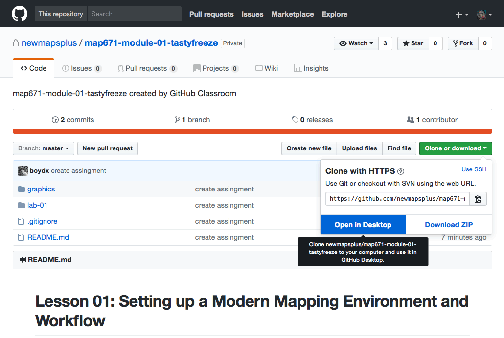
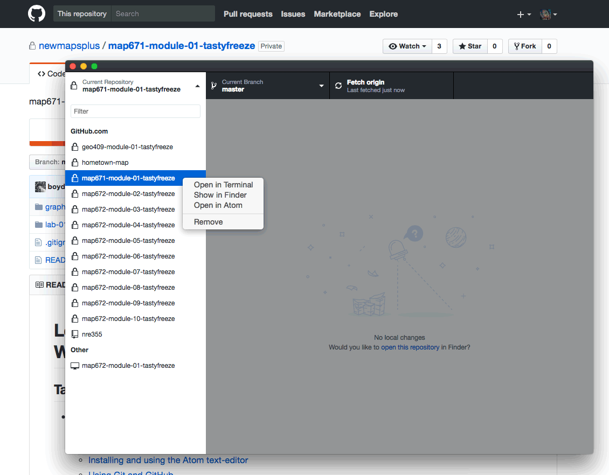
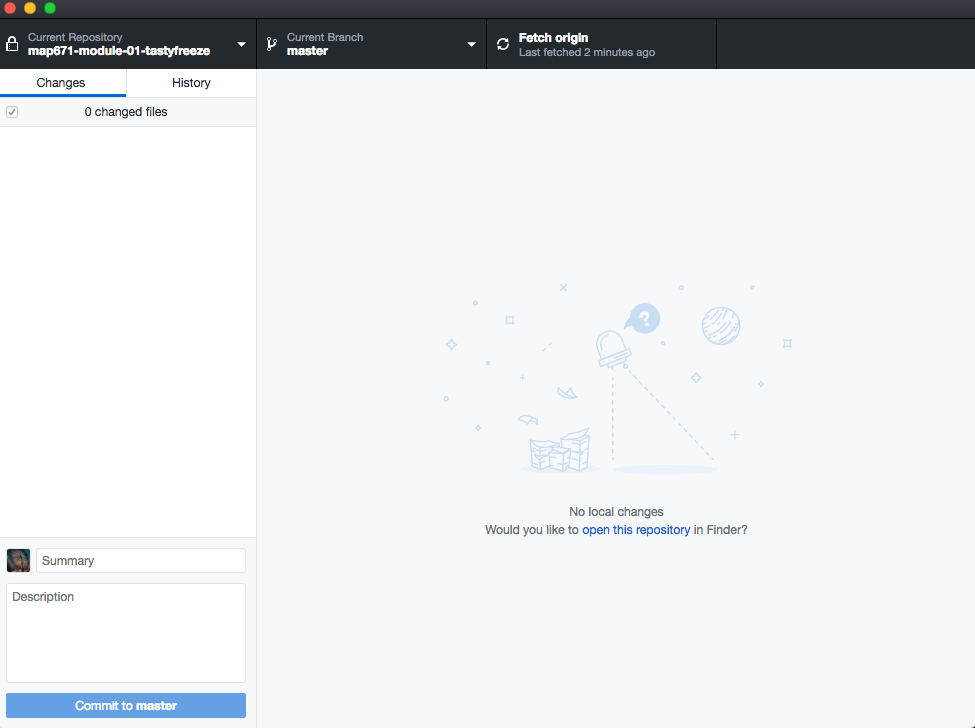
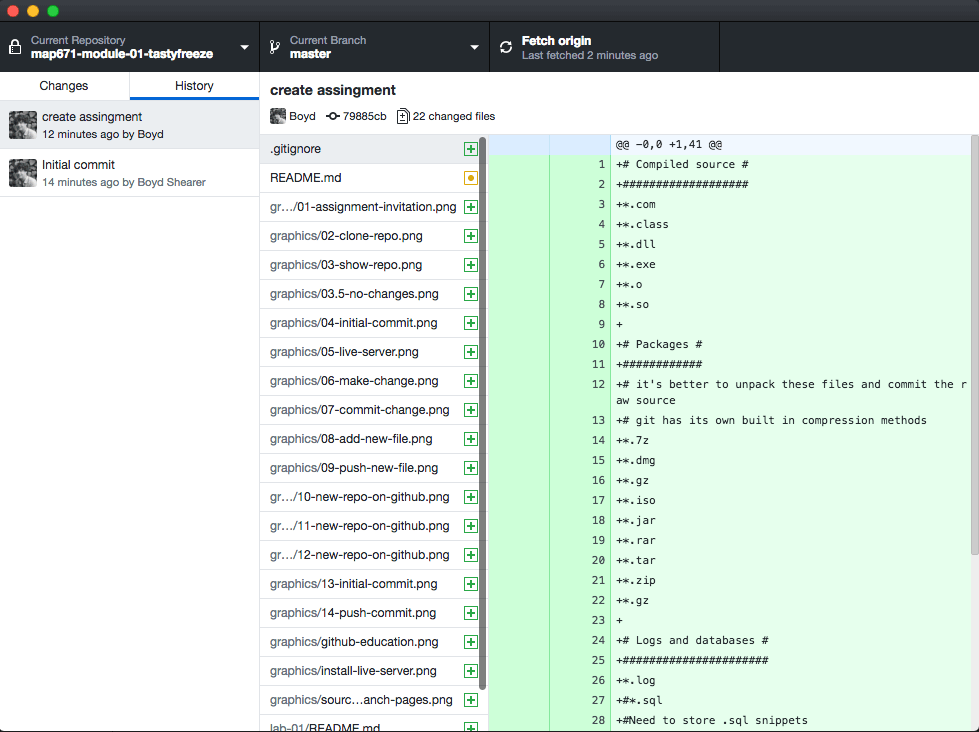
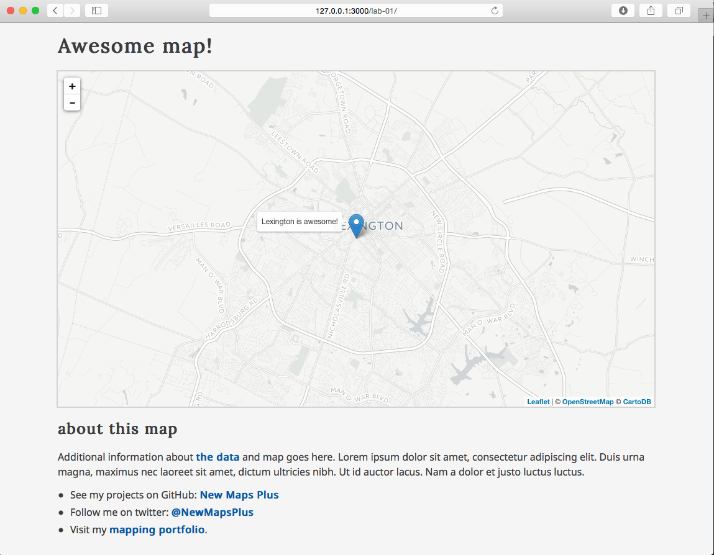
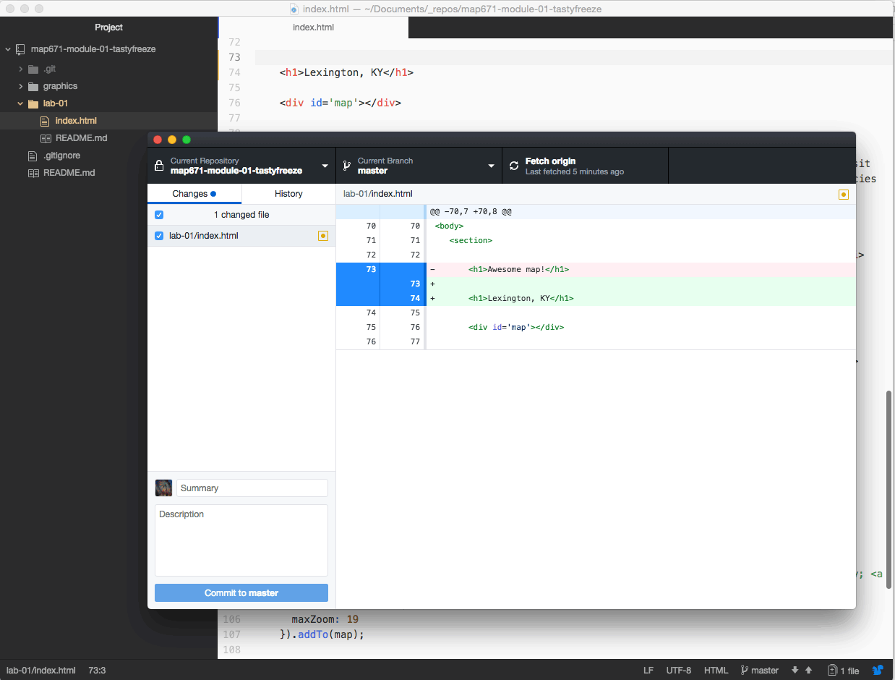
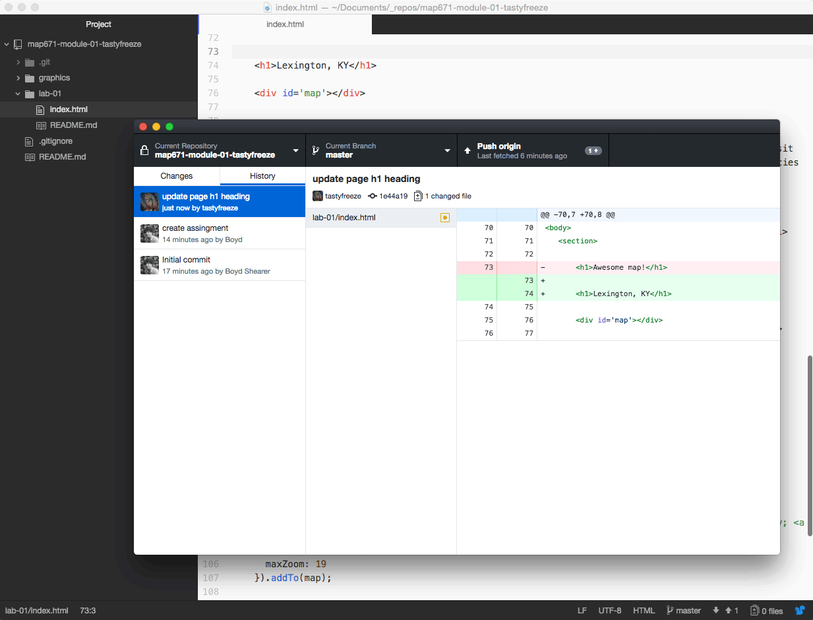

Source:  Faculty at UKY Digital Mapping

### Introduction: What is Git?

Git is a **Distributed Version Control System (DVCS)**. Okay, but what's a version control system (VCS)? A VCS records all changes made to a computer file or set of files. This allows you to review any changes made to the files under version control and allows previous versions of files or projects can be recalled at a later time. Basically, if you mess something up, accidentally delete or copy over a file, you can retrieve an earlier copy of that file.

We'll note now that there are two ways of installing and using Git on your computer system: 1.) with a desktop software client, and 2.) via command line (using the Command Prompt on Windows or the Terminal on a Mac).

**Recommended:** We're going to primarily be instructing this course with the first method using the [GitHub Desktop Client](https://desktop.GitHub.com/) because of the simplicity and ease of use. You might notice the website announces, "The new native." The software was recently updated and is significantly different that the previous version; a common theme we'll notice with open source software. Most importantly, this software installs the Git software on your system along with the client interface (so no need to do that step separately).

To use git outside of the GitHub Desktop client, you need to have experience with using shell or command line prompts. To use Git via command line, you need to first install Git on your machine ([Git for Windows Setup](https://git-scm.com/download/win) or [Installing on Mac](https://git-scm.com/book/en/v2/Getting-Started-Installing-Git#Installing-on-Mac)), preferably so it's globally accessible (i.e., you can run a Git command from whatever directory you're in). Then, rather than using a software interface to use Git, you'll be issuing textual commands.

Additionally, one advantage of using the Atom text editor is its tight integration with Git and GitHub (the editor was actually written by GitHub). You can use the awesome [Git-Plus package](https://atom.io/packages/git-plus) to use Git with your development projects.

If you wish to pursue a more [advanced command line approach](https://git-scm.com/book/en/v2/Getting-Started-Installing-Git), that's great! But understand that we're not explicitly teaching this method within the course and that the course instructor may not have the time to troubleshoot potential problems with you.

The process for connecting with GitHub is a little more complicated as well, so if you want to make life easier for the time being, just stick with the Desktop Client.

<a name="a-brief-background-to-git-and-history-of-version-control"></a>
#### A brief background to Git and history of version control

VCSs have been used for a long time. A very simple form of version control is simply making backups of your files or project directories and storing on a local computer or network system. Of course, this requires one keep careful track of files and file names, often manually. Developers use centralized Version Control Systems (CVCSs) to collaborate with others on projects, which used a single server and database to store files and keep track of all versioned files and changes. Examples of these CVCSs include Subversion and Perforce. While CSVSs were better than developers keeping their own versions of files on their local machines, this centralized approach also provides a single point of failure. If the server crashed (or even worse, became corrupted), the project was still at risk of being lost.

To address this risk, in recent years developers have migrated their workflow to Distributed Version Control Systems (DVCS) such as Git, Mercurial, Bazaar, and Darcs. The primary benefit of a DVCS is that rather than keeping a single backup of a project, every client who "clones" the project fully mirrors the entire repository. This approach "distributes" a full backup of project files among all local computers working on the project.

Git takes a particular approach to version control. Rather than making a fullback of the project with each version and storing a list of file-based changes like other VCSs, Git saves the state of the project as a "snapshot" of what the files look like at the time of commit (more on "committing" below). If a file has changed since the previous commit, then Git saves those changes and records a reference to it within a "snapshot." If a file hasn't changed, then there is no need to re-copy the file (or the entire project's directory structure!). Git retains the previously stored reference, making it very efficient compared with other VCSs.

Another advantage of Git is that repositories are always downloaded, stored, and manipulated locally  (i.e., no need for server requests), which means Git runs very fast, and you can work even without an Internet connection.

Today, another huge advantage of using Git is its close integration with [GitHub](https://github.com/). **GitHub** is a company that provides a Git-enabled platform to share your Git repositories. This is very powerful as it allows other people to collaborate with you on the same repository, and you can even share your projects with the broader public via open web pages. During the course, you will also use this mechanism to submit and share your assignments with your instructors.


### Download GitHub for Mac/Windows and basic configuration

Now that we have our remote GitHub account set up on the web, let's get Git and the GitHub Client running on our local computer. Depending on your operating system, download the GitHub Desktop Client from [https://desktop.github.com/](https://desktop.github.com/).

Once downloaded and opened, GitHub Desktop will ask you to walk through some configuration steps. Enter your GitHub username and password, and then supply your name and email. Please use your real name so that your colleagues and instructors can identify you. This allows the Desktop Client application to pull down files from a remote repository, as well as to add, commit, and push changes to files up to a remote repository.

Once the configuration is successful, you should see an empty GitHub window. We’re finally ready to roll!

For further documentation on this process, see [Getting Started with GitHub Desktop](https://help.github.com/desktop/guides/).

Now that we have our GitHub account connected to the Desktop Client, we'll use it to complete two important processes for this week's module: 1.  Cloning a repository down to our local machine and 2. Creating a new repository on GitHub.

### Cloning down the weekly New Maps Plus assignment repository.

Each week a URL is provided in Canvas to the lesson and assignment hosted as repository on GitHub. When you click on this link, Github will copy this private repository into your account and add your username as a suffix to the repo name. Only you and the instructor have access to this repo.

First, clone the remote *map671-module-01-username* created for you for the assignment. With your GitHub Desktop application open, click on the main menu and find **File > Clone Repository...**. This presents you with a list of the remote GitHub repositories associated with your GitHub account(s) and username (you must be logged into GitHub).

Navigate to your repo or search for it within the **Filter** (if this is your first GitHub repository, then there will only be the one) and choose **map671-module-01-username**. You'll note that it is listed under the newmapsplus organization within Desktop Client.

**NOTE:** Throughout this lesson, when "username" is written you should substitute your own GitHub username.

  
Figure 03. Cloning the weekly module repository in GitHub

GitHub Desktop will then clone (i.e., make a copy of) the *map671-module-01-username* repository on your local machine. Select a location on your computer to save your repository. It doesn't matter where it is, as long as you remember where. As always when working on a computer, **stay organized and know where on your system your files/directories are**!

It would make sense to create one directory named something like *map671* and clone each weekly repo into that directory.  Create this directory, select that location and choose **Clone**.

After you click **Clone**, GitHub Desktop will copy the repository from the remote web server to your local machine. Once it's complete, you can verify the process by looking at the repository within your local file/directory structure (hint: you can right-click on any repo name within GitHub Desktop and choose **Open in Finder**).

  
Figure 04. Opening the local repository directory through Finder

When you open this repository in your file/directory structure, you'll see that the repository is contained within a directory named *map671-module-01-username*. Within this repo, you'll see the *README.md* file that is this lesson.

You may also see a (hidden) directory is named *.git* (if not you can enable your Operating System to view hidden files on your computer). The *.git* directory is used internally by Git to track your files and changes, and you will not directory use the files within this directory. Deleting it will delete the record of your repository. A Git repository also uses relative paths with respect to this *.git* directory, so you can easily move the entire *map671-module-01* directory to another location on your drive or another computer (or USB drive) and continue working with the files while Git tracks your changes!

Switch back to GitHub Desktop. Note that at the top of the window are two tabs: One says "No Uncommitted Changes." This indicates that you currently have no committed changes recorded by Git, and the panel below indicates "0 changes."

  
Figure 05. No uncommitted changes in the repository

Next, click on the **History** tab. This will show you all the committed changes to your repository. Here we see there is the commit history of recent changes made to the repository.

  
Figure 06. Viewing the commit history of the repository

All further changes and commits will first happen within your local development environment and then pushed up to the remote copy of the repository. Let's practice doing that now.

But first, let's use the the atom-live-server to view the *lab-01/index.html* file in our web browser. You can open this file in your Atom text editor and examine the HTML, CSS, and JavaScript within it. Don't worry if it all looks like Greek right now; we'll be taking a closer look at these web standards over the following weeks.

Going to **Packages -> Live Server ->** in the file menu allows you to open the file using a web server (covered in lesson 02) through various ports on your computer (choose **Start on port 3000**). It generally doesn't matter which one you select. Note that there are also convenient keyboard shortcuts to do this as well.

Go ahead and launch the live server. You'll see the file/directory structure now within your web browser, and navigating to within the *lab-01/* The application should open the file within your web browser, and you should see a basic web map centered on Lexington.

  
Figure 07. Index.html file served using atom-live-server package

We'll be covering how this file makes the web map and page in subsequent modules. For now, let's make a few modifications to the file to better understand the Git process.

### Making changes to your repository

Launch your Atom text editor if not already open. Choose **File -> Add Project Folder**, and navigate to your local copy of the *map671-module-01-username* repository. **IMPORTANT:** throughout this course, it is best to **open the entire directory** of the repository or individual directories within it (e.g., a weekly*module-02* directory), rather that directly opening a single file. Doing so conveniently keeps the file/directory accessible to you within a text editor's file tree in the sidebar.

<a name="editing-existing-files-within-a-git-repository"></a>
#### Editing existing files within a Git Repository

Let's open the *lab-01/index.html* file within the Atom editor and make some basic changes to it. Make the following modifications to the file and **save your changes**.

On line 71, change the text to something other than "Awesome map!" here:

```html
<h1>Awesome map!</h1>
```

I'm going to change mine to this:

```html
<h1>Lexington, KY</h1>
```

**IMPORTANT:** Always remember to save your changes to your file in your text editor before looking for the result in the browser or GitHub Desktop.

After you save the changes, switch to your web browser. You can see your heading has been "live-updated" in the browser.

Now switch back to the GitHub Desktop. We can see at the top of the client that there is "**1 Uncommitted Change.**" Click on this tab. In the right-hand panel, you can see the previous text highlighted in red, and the new text highlighted in green. In Git-speak, this is called a "diff" — it shows the difference between two version of the same file. You have removed lines with a small "-" and have added those with a small "+." Green and red colors indicate key additions/removals.

  
Figure 08. Seeing one uncommitted change in GitHub Desktop

Next, let's commit this change to our repository. A commit bundles anything that has changed and creates a snapshot of the current state of the repository. Each commit then becomes an individual snapshot that you can access later.

Every commit to a repository requires a commit message. These messages should be descriptive of the changes you made to the files since the last commit. The convention is to use present tense verbs (i.e., "update map title" or "add GeoJSON file to project").

Within the GitHub Client, enter a commit message. You can also add a longer description of the commit (such as for commits that involve many changes to several files). When complete, hit **Commit to master**.

Note that we add this commit to the master branch (we'll talk more about branches and branching later on).

In this case I'll enter the commit message "update page h1 heading" and click **Commit to master**.

After clicking **Commit to master**, GitHub Desktop returns to show there are **"No Uncommitted Changes."** Clicking back to the **History** panel how displays the most recent commit message.

  
Figure 09. History panel of GitHub Desktop showing the last two commits
